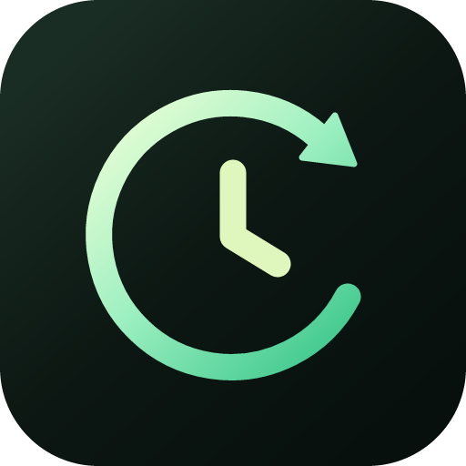

# 时序（TimeGenie）

<p align="center">
  
</p>

<p align="center">
  <a href="https://github.com/yedsn/time-genie"></a>
  <a href="https://gitee.com/hongxiaojian/time-genie"></a>
  
  
  
  
</p>

时序（TimeGenie）是一个 Windows 优先的本地优先桌面工作台，用于管理待办、记录与分配工时、生成日报/周报/月报，并与 Obsidian、SeaTable、Supabase 衔接。

它面向需要每天整理计划、计时、结算和汇报的人：待办负责承接计划，计时负责留下真实工作记录，报告负责把结果整理成可复制、可写入 Obsidian 的 Markdown。

## 为什么使用

- **工作过程闭环**：从今日待办、计时、工时分配到日报/周报/月报都在同一个桌面应用中完成。
- **本地优先**：默认使用本机 SQLite，不依赖网络即可记录工作；敏感 Token 和登录会话保存到系统凭据库。
- **可选云端模式**：接入 Supabase 后，可以把 PostgreSQL 作为权威数据源，并通过 Realtime、离线队列和冲突处理支持多设备使用。
- **外部工具友好**：支持从 Obsidian 导入计划、把报告写回 Obsidian，也可以将待办同步到 SeaTable 并查询待报销信息。
- **面向结算的时间规则**：计时、补录、未归属时间和最终事项分配分开保存，避免把“记录过时间”误当成“已经结算”。

## 核心功能

| 模块 | 能力 |
| --- | --- |
| 今日 | 查看今日概览、趋势、待结算工时和未归属时间入口 |
| 待办 | 多主体、层级待办、拖拽排序、缩进、复制子树、完成状态、今日预计用时 |
| 计时 | 开始/暂停/继续/结束计时，手动补录，按事项拆分分配工时 |
| 未归属时间 | 后台累计超过阈值后要求处理，可分配给事项、记为休息或丢弃 |
| 报告 | 统一管理日报、周报、月报，支持模板、编辑、重新生成、复制上报版和写入 Obsidian |
| SeaTable | 连接检测、待办同步预览、确认写入、失败重试、待报销查询 |
| Supabase | 邮箱密码登录、本地迁移云端、云端缓存、增量同步、离线队列和冲突处理 |
| 托盘 | 悬浮面板、全局计时状态和最小化启动等设备级设置 |

## 主要流程

### 1. 首次配置

1. 打开“设置”。
2. 在“本机配置”中填写 Obsidian 根目录和日报路径规则，默认规则为 `工作日报/{date}.md`。
3. 选择报告时长格式，默认使用分钟，例如 `90min`；也可以切换为一位小数小时，例如 `1.5h`。
4. 根据需要设置工资时薪。
5. 如需连接 SeaTable，填写服务地址、事项表、事项视图、报销表和“本地事项 ID”字段，再填写 Base API Token。
6. 如需多设备使用，先在 Supabase SQL Editor 执行 [`supabase/schema.sql`](supabase/schema.sql)，再在“数据存储”中填写 Project URL 和 anon key，用邮箱密码登录。
7. 登录后先查看本地数据迁移预览，确认后再执行迁移。

SeaTable Token、Supabase 会话等敏感内容会保存到系统凭据库，不进入普通数据文件或报告。

### 2. 每日工作

1. 在“待办”中选择主体，可从前一天 Obsidian 日报导入“明日计划”，也可直接创建事项。
2. 在窗口右上角、计时页或托盘悬浮窗选择叶子事项并开始计时。父事项的用时由子事项汇总，不能直接计时。
3. 计时结束后，在“计时”页确认工时归属。一段时间可以拆分给多个事项。
4. 超过 5 分钟的后台未归属时间必须处理，可以分配给事项、记为休息或丢弃。
5. 在“报告”中创建日报、周报或月报，选择主体、日期范围和需要导入的事项。
6. 报告可继续编辑、保存、重新生成、复制上报版或写入 Obsidian。

### 3. 报告与 Obsidian

- 日报使用设置中的路径规则；周报写入 `工作周报`，月报写入 `工作月报`。
- 写入前会显示目标路径和内容预览。
- 目标文件存在时可选择追加或覆盖。
- 文件在预览后被其他程序修改时，系统会阻止写入并要求重新预览。

### 4. SeaTable 同步

- SeaTable 是外部同步目标，不是本地业务数据的主存储。
- 正式同步前应先检查连接并查看新增、更新、跳过和冲突预览。
- 重复同步应使用稳定事项 ID 或外部绑定，不应仅按标题静默匹配。
- 部分失败不会删除本地待办、计时或分配数据，可只重试失败项。
- 未配置报销表时仍可同步事项，只会在周报/月报中显示“待报销：尚未查询”。

## 工时结算规则

- 原始工时来自计时器、手动补录和处理后的未归属工作时间。
- 已分配工时来自时间记录下的最终事项分配。
- 待结算工时等于原始工时减去已分配工时。
- 有效时间不足 1 分钟时按 1 分钟结算，其余零散秒数向上取整。
- 暂停期间不计入原始工时。
- 修改时间范围后，如果已有分配超过新的原始工时，系统会拒绝保存并提示超出分钟数。

## Supabase 云端模式

云端模式适合需要在多台设备之间同步同一份工作数据的场景。

- Supabase PostgreSQL 是云端模式的权威数据源，SQLite 只保留本机缓存、同步状态和离线队列。
- 桌面端只允许配置 anon key，拒绝 service role key；用户会话保存到系统凭据库。
- 已提供 Auth、工作空间、设备注册、RLS、变更序列、迁移入口、全局单计时器 RPC 和 15 秒续租/45 秒过期的后台采集租约。
- `schema.sql` 会显式撤销匿名角色对业务表和保护 RPC 的访问，只向 `authenticated` 授予 API 所需权限；RLS 再按账号限制工作空间范围。
- Realtime 订阅 `workspace_changes`，客户端按 `change_seq` 增量补拉。
- 当前未接入云端事务的业务写操作会明确提示不可用，不会回退写入本地 SQLite。

正式启用前，建议在两台设备上完成登录、迁移、冲突和计时互斥验证。

### 双设备端到端验证

仓库提供一个默认跳过的真实 Supabase 验证。它使用两个独立 SQLite 数据库模拟两台设备，并依次验证邮箱密码登录、工作空间和设备注册、本地数据迁移、Realtime 通知与增量拉取、离线 outbox、版本冲突、全局单计时器和后台采集租约。

该验证会删除测试账号名下现有工作空间，并在完成后再次清理。请使用专门的可丢弃测试账号，不要使用正式账号。

```powershell
$env:TG_SUPABASE_URL="https://your-project.supabase.co"
$env:TG_SUPABASE_ANON_KEY="your-anon-or-publishable-key"
$env:TG_SUPABASE_EMAIL="e2e-user@example.com"
$env:TG_SUPABASE_PASSWORD="test-password"
$env:TG_SUPABASE_E2E_ALLOW_RESET="1"
npm run test:supabase:e2e
```

运行前需要先在目标项目执行 [`supabase/schema.sql`](supabase/schema.sql)，并确保测试账号已经创建且可以使用邮箱密码登录。

也可以使用仓库内的 [`supabase/config.toml`](supabase/config.toml) 启动一次性本地 Supabase 环境。需要先确保 Docker Desktop 的 Linux 引擎可用：

```powershell
npx --yes supabase@2.117.0 start
npx --yes supabase@2.117.0 status -o env
```

随后在本地 SQL Editor 执行 [`supabase/schema.sql`](supabase/schema.sql)，通过本地 Auth 创建专用测试账号，并将上方变量中的 URL、anon key、邮箱和密码替换为本地环境值。

应用仅允许 `localhost`、`127.0.0.1` 和 `[::1]` 使用 HTTP/WS；其他 Supabase 地址仍强制使用 HTTPS/WSS。

## 开发

### 环境要求

- Node.js 与 npm
- Rust 工具链
- Tauri 2 所需的 Windows 构建环境

### 安装依赖

```powershell
npm install
```

### 启动桌面开发环境

```powershell
npm run tauri:dev
```

### 类型检查与前端构建

```powershell
npm run typecheck
npm run build
```

### 打包桌面应用

```powershell
npm run tauri:build
```

Windows release 入口使用 `windows_subsystem = "windows"`，不会额外显示控制台窗口。

## 测试

```powershell
npm run test:allocation-math
npm run test:completion-feedback
```

Supabase 双设备端到端验证需要真实或本地 Supabase 环境，见上方“Supabase 云端模式”。

## 项目结构

```text
src-ui/              Vue 3 前端界面
src-tauri/           Tauri 2 + Rust 桌面后端
src-tauri/migrations 本地 SQLite 迁移
supabase/            Supabase schema、配置和集成验证 SQL
docs/                数据结构与后端接口设计文档
scripts/             针对核心规则的验证脚本
openspec/            需求变更与规格文档
```

## 项目状态

- 当前版本为 `0.1.0`。
- 项目以 Windows 桌面使用为主，配置中已定义 Tauri Windows 主窗口和托盘悬浮窗口。
- 默认本地模式可独立使用；Supabase 云端模式需要先部署仓库内 SQL 并完成账号配置。
- 仓库包含 GitHub 与 Gitee 远端，当前没有配置 CI workflow。

## License

`package.json` 和 `src-tauri/Cargo.toml` 当前声明为 `MIT`。仓库根目录还没有 `LICENSE` 文件，发布前建议补齐根目录授权文件，并以该文件作为最终授权依据。
